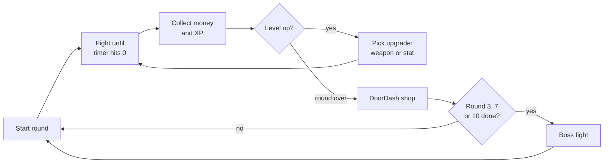

# Boogie Down Maple Scary Street — Design v2

Sep 24, 2026 · @Cooper

The blueprint for the Unity build: a 1–4 player co-op survival game on Mac and Windows where you level up, shop between rounds, and fight bosses after rounds 3, 7 and 10.

## Overview

Pick a character and survive timed rounds of fast-food workers and cops, leveling up and shopping as you go.

| Item | Plan |
| --- | --- |
| Genre | PvE survival (PvP maybe later) |
| Players | 1 now; target 1–4 |
| Multiplayer | LAN, split-screen co-op, online |
| Platforms | macOS and Windows |
| Engine | Unity (port of the current web build) |

**Start of a run:** every stat starts at 0 and health at 25 HP. You get 5 weapon slots and 5 upgrade slots. Each character has their own starting weapon or perk; more weapons come from the shop. In co-op, player 1 and player 2 each pick a character.

## Gameplay loop

Fight until the timer hits 0, level up along the way, shop with DoorDash, and face a boss after rounds 3, 7 and 10.

Level-ups happen mid-round; the shop only comes after the timer ends.

## Player stats

Seven stats, all starting at 0, which means base level (not upgraded yet); you raise them with level-up picks and shop upgrades.

| Stat | What it does |
| --- | --- |
| Health | How much damage you can take (start 25 HP) |
| Strength | Melee damage |
| Precision | Ranged damage |
| Speed | Movement speed |
| Luck | Chance of rare drops and criticals |
| Defense | Damage reduction |
| Crit Chance | Chance for bonus damage |

XP fills your level bar; each level grants one upgrade pick.

## Rounds

Rounds run 30 seconds longer each time (2:00 to 6:30), and a boss round lasts until the boss is beaten.

| Round | Time | Enemies |
| --- | --- | --- |
| 1 | 2:00 | McDonald's L1 |
| 2 | 2:30 | McDonald's L1–2 |
| 3 | 3:00 | McDonald's L1–3 |
| Boss | Until defeated | Jack (100 HP) |
| 4 | 3:30 | McDonald's L1–3, Cane's L1 |
| 5 | 4:00 | McDonald's L1–3, Cane's L1–2 |
| 6 | 4:30 | McDonald's L1–3, Cane's L1–3 |
| 7 | 5:00 | McDonald's L1–3, Cane's L1–3 |
| Boss | Until defeated | Eva (150 HP) |
| 8 | 5:30 | McDonald's L1–3, Cane's L1–3, Cops L1 |
| 9 | 6:00 | McDonald's L1–3, Cane's L1–3, Cops L1–2 |
| 10 | 6:30 | McDonald's L1–3, Cane's L1–3, Cops L1–3 |
| Boss | Until defeated | Andique (200 HP) + family (25 HP each) |

Round 7 adds no new enemy type; it is the full McDonald's and Cane's mix before Eva. An endless mode after Andique is planned.

## Enemies

Three crews with three levels each; once a level appears it stays in every later round.

| Crew | Level | First appears | Weapon / attack |
| --- | --- | --- | --- |
| McDonald's worker | 1 | Round 1 | Fists |
| McDonald's worker | 2 | Round 2 | Spatulas, fryer cage |
| McDonald's worker | 3 | Round 3 | Tray of food: throws burgers, fries, sodas |
| Cane's worker | 1 | Round 4 | Throws chicken tenders |
| Cane's worker | 2 | Round 5 | Throws Texas toast bombs |
| Cane's worker | 3 | Round 6 | Cane's sauce gun |
| Cop | 1 | Round 8 | Batons |
| Cop | 2 | Round 9 | Pistols |
| Cop | 3 | Round 10 | Shotguns |

## Bosses

Three bosses are placed in the round order; Natalie and Boilermaker Pete are designed but not yet scheduled.

| Boss | When | HP | Special | Normal attack | Mega attack |
| --- | --- | --- | --- | --- | --- |
| Jack | After round 3 | 100 | — | Dumb jokes that stun you | Gas farts |
| Eva | After round 7 | 150 | Takes 50% of your money | Straight-line rams with her car | Her car explodes into a big bomb |
| Andique | After round 10 | 200 | Takes away two upgrades | Throws snacks and drinks | Calls his son, daughter and wife (25 HP each); all four throw snacks and drinks |
| Natalie | TBD | — | Takes something away for the rest of the run (TBD) | Loud talking that shoots vocals at you | Laugh that shoots vocals in every direction |
| Boilermaker Pete | TBD | — | — | Throws his hammer, fires a shirt gun | Hammer slam shockwave that stuns on hit |
| Garret Bobby Ferguson (DLC) | DLC | — | — | Eye lasers; pixelated enemies spawn | Rapid fireballs |

## Characters

Eight base characters, each starting with a different weapon or perk.

| Character | Starts with |
| --- | --- |
| Cooper | Law Book |
| Nathan | Guitar |
| Isaiah | Skateboard (no weapon) |
| John | 6-pack of beer |
| Will | No weapon; alcohol never makes him dizzy |
| Piper | Crutch |
| Thorton | No weapon; starts with $100 |
| Kenny | Box of Goldfish |

**DLC characters:** Sassy, Donnie, DJ Shaq, Talan, Arry, Lily, Mordecai, Rigby.

## Upgrades

Each upgrade levels up without limit, but you can hold only 5 different upgrades at a time.

| Upgrade | Effect |
| --- | --- |
| Energy drink | Speed boost |
| Shooter | Strength boost, but you get tipsy |
| Pee | Knockback, but stinky breath |
| McDonald's bag | Faster health regen |
| Cane's chicken | Higher max health |
| To-go box | +5 upgrade slots (stacks) |
| Backpack | +1 weapon slot (stacks) |
| Skateboard | 2× speed, 1.5× jump height |

## Weapons

You start with 5 weapon slots; with nothing in hand you punch.

| Weapon | How it works |
| --- | --- |
| Fists | Default when your hands are empty |
| Deck of Cards | Throw cards; 64 per deck, and the deck is discarded when empty |
| Poker Chips | Upgrades change the chip color: white, red, blue, green, black; each step adds damage and range |
| Guitar | Strum musical notes at enemies |
| Law Book | Melee hits; when charged, slam it on the ground yelling "OBJECTION" |
| Crutch | Long-reach melee swing |
| Box of Goldfish | Throwable |
| 6-pack of beer | Drink, then throw the bottles or hit with them until they break; refill at the fridge; drinking boosts strength but makes you dizzy |

## Locations and skins

Scary Street is the one location in development; the rest are coming later.

| Location | Status |
| --- | --- |
| Scary Street | In development |
| McDonald's | Coming soon |
| Cane's | Coming soon |
| Dublin | Coming soon |
| Trump House | Coming soon |
| Brown Town, Chuma Island, Regular Show Park, Adventure Time Tree House | DLC |

| Character | Skins |
| --- | --- |
| Cooper | Normal, Weed Man w/ Cane, Intern Cooper, Groot Cooper, Legendary Drop |
| Nathan | Normal, Ireland Nathan, Black Suit Nathan, Rocket Nathan, Legendary Drop |
| John | Regular, Ireland John, Skibidi Toilet John, Legendary Drop |
| Isaiah | Regular, Presentation Night Isaiah |
| Will | Normal, Shirtless Will |
| Piper | Normal, Knee Brace Piper, Teacher Piper |
| Thorton | Normal, Suit Thor, Ireland Thor, Legendary Drop |
| Kenny | Normal, Ireland Kenny, Receipt Covered Kenny, Legendary Drop |

## Open questions

Settle these before the Unity build locks in round and boss order.

- [x] Cane's workers start in round 4, right after Jack.
- [x] Eva comes after round 7.
- [x] Andique comes after round 10.
- [x] Stats at 0 = base level, nothing upgraded yet.
- [x] Natalie and Boilermaker Pete: rounds and Natalie's take-away still to come.
- [x] Endless mode after Andique: planned, rules to come.

**Licensed content:** Mordecai, Rigby, Regular Show Park, Adventure Time Tree House, Brown Town and Chuma Island (Big Lez), Garret Bobby Ferguson, and the Groot, Rocket and Skibidi Toilet skins belong to other studios. A public release can be taken down for using them; plan original parody versions instead. Real brands (McDonald's, Cane's, DoorDash) are safer as lookalike names and colors without logos.
